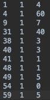

# Essay Scoring

本次作业是文章自动评分，是自然语言处理的很重要的一个任务。性能良好的文章自动评分系统可以帮助节省老师的时间，同时也可以让学生获得及时的反馈。一般老师给文章打分时，从不同的角度判断文章的质量，比如语法有没有错误、逻辑够不够严密、说服力够不够强、风格是否合适等等；文章自动评分系统也可以从这些不同的角度考虑，如何评估文章的质量。
本次作业划分为三个部分：
- 一：使用传统机器学习方法去预测分数。首先要自己设计特征，然后利用传统的回归或者分类方法预测分数（要思考：这个任务适合做回归还是分类）。
数据集有8个不同的essay set，模型要在每一个essay set上跑并输出预测结果（即利用set 1 的训练数据训练模型，利用该模型预测
set 1 essay 的分数等等）。
- 二：使用深度学习方法去预测分数。跟第一个部分一样，模型要在每一个essay set上跑并输出预测结果（即利用set 1 的训练数据训练模型，
利用该模型预测set 1文章的分数等等）。
- 三：做跨set的方法：在这个试验设置中，你完全没有目标文章集的标签数据，所以预测某个set的分数，只能利用其他set的essay数据进行训练和验证，
比如说预测set 1文章的分数，只能使用其他set(s)的文章做训练和验证。首先利用第一部和第二部的方法针对这个任务，哪个方法的效果最好？为什么？
然后利用新的方法去面对该任务。要思考，set之间的文章有什么通用的信息可以利用，可以去看知识迁移的论文。
三次作业的具体实验设置可以去看`实验设置`的文件。

## 文件夹
- `essay_data`：本文件夹里有三份文件 – `train.tsv`、`dev.tsv`、`test.tsv`。
    - `train.tsv`：有标签（`domain1_score`），使用这个训练模型
    - `dev.tsv`：有标签（`domain1_score`），使用这个验证模型的性能
    - `test.tsv`：无标签，预测本文件里的文章
    
- `essay_set_descriptions`：有一些关于数据集的信息，比如文章集的prompt是什么、批改的指南等信息。
- `relevant_papers`：针对本任务的一些相关的论文。
- `training_materials`：本来文章是手写的，本文件夹里有给抄写员的指南。

## 指标
- 为了评测模型，提供`metrics.py`的代码。里面有许多不同的指标，但是我们要用quadratic weighted kappa评测。
自己评测的时候要调用`kappa()`而把真理标签的列表、预测结果的列表以及`'quadratic'`字符串作为参数传递给该函数，比如：
`my_qwk = kappa(y_true, y_predicted, 'quadratic')`
- 本代码有一些依赖性需要下载，在`requirements.txt`可以看到。

## 提交方法
- 模型是针对每一个essay set单独跑的，结果提交的时候需要把8个set的结果都整理在一份.tsv文件里提交。
- 预测结果文件的格式为`essay id`, `set（1–8）`，`prediction`（利用`\t`），比如： 

- 预测结果文件与`test.tsv`的长度必须一样，而且每一条的ID都要有在`test.tsv`匹配ID的一条，要不然评测系统会出错。